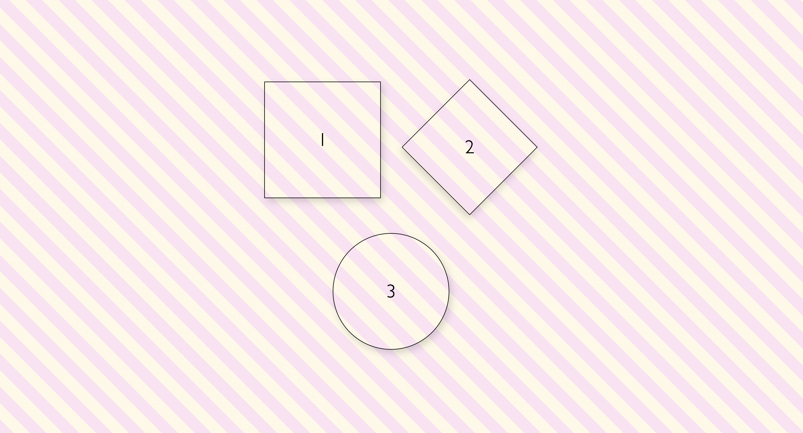

### 🎨 Hover Color Effect

# My first GitHub project — a simple HTML & CSS hover color effect.
## 🚀 Features
* Pure HTML & CSS
* Color transition on hover
* Beginner-friendly project

### 📸 Screenshot of the project

<!--  -->

### 🔗 Live Demo of project 
[View Project](https://hovershapes.netlify.app/) 🚀
